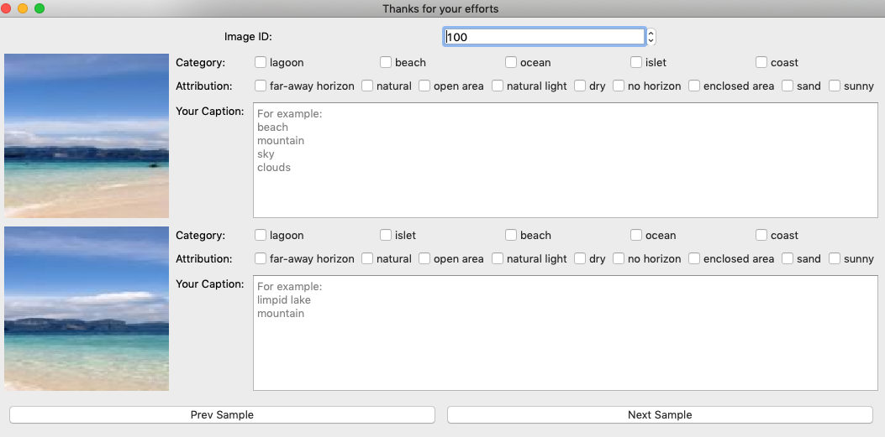

# Label the images

Requirements:
 * python 3.6
 * PyQt5
 * requests
 * skimage

Install python 3.6 and pip, and install the requirements:
``` bash
pip install python-qt5 requests scikit-image
```

Then, run the main.py to start:
``` bash
python main.py
```
Steps:
* Download this project and install the requirements.
* Select or input the beginning image Id in the top "Image ID" box.
* Input the key words (split by newline character) for two images in their corresponding text areas.
* Click 'Next Sample' to continue, and the result will be automatically saved in './caption_result/' dir.

Example



The program may be stuck when you press the button, this is caused by the remote image requesting, please wait a moment ...

The "Category" and "Attribution" show some classification information and attributions, they are predicted by the [Place365 model](https://github.com/CSAILVision/places365) and are only for reference purpose, because they are not reliable enough.

When you finished your work, pack the './caption_result/' to file 'start-id_end-id.zip', e.g. '10_100.zip', and upload it in [this site](http://holer.cc:50347)
# Thank you very much!
