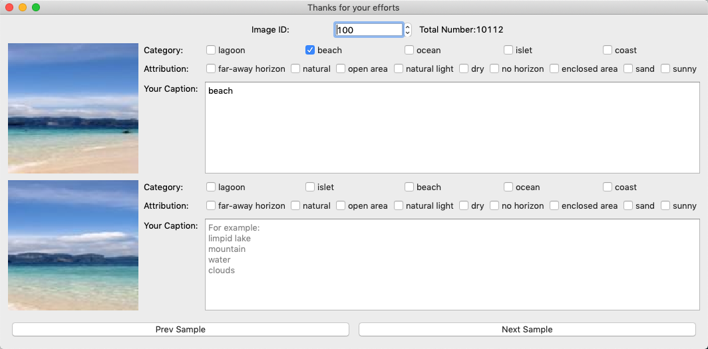

# label_image_script
Annotate the images

Requirements:
 * python 3.6
 * PyQt5
 * requests
 * json

Install python 3.6 and pip, and install the requirements:
``` bash
pip install python-qt5 requests json
```

Then, run the main.py to start:
``` bash
python main.py
```
Example



Steps:
* Download this project and install the requirements.
* Select or input the beginning image Id in the top "Image ID" box.
* Input the descriptions for two images in their corresponding caption areas.
* Click 'Next Sample' to continue, and the result will be automatically saved in './caption_result/' dir.

The "Category" and "Attribution" show some classification information and attributions, they are predicted by the [Place355 model](https://github.com/CSAILVision/places365) and are only for reference purpose, because they are not reliable.

# Thank you very much!
